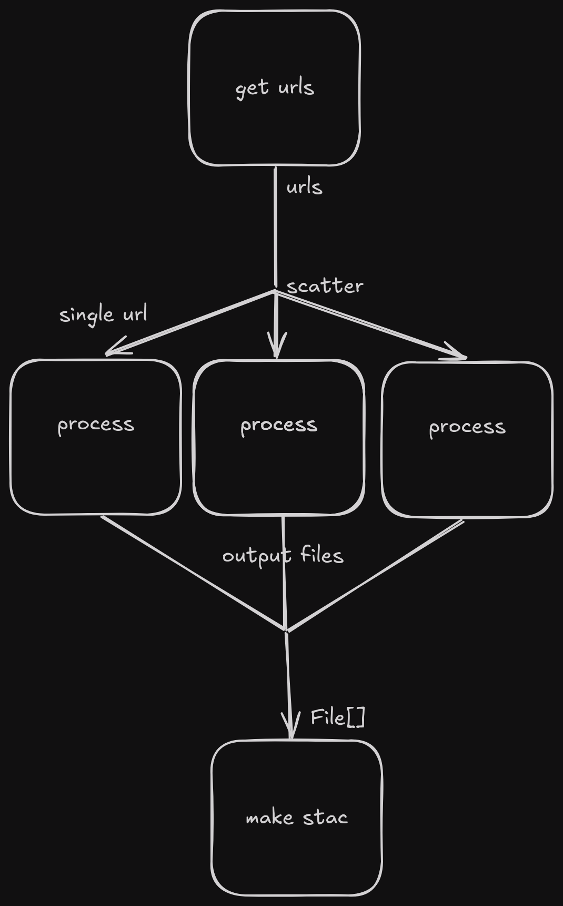

# eoap-gen guide for ADES

In this tutorial we'll create an Earth Observation Application package and upload it to ADES. This package have 3 steps:

1. Get urls of all cogs in a collection - Custom python script
2. Resize all cogs to 5% of their original size - using an existing docker image for GDAL
3. Create a STAC catalog from the resized cogs - Custom python script

The flow of inputs/outputs between steps in the workflow will be like this:

<p align="center">
<a href="wf_diagram.png"></a>
</p>

## Scripts

### Python CLI script

Create a python CLI script using [click](https://click.palletsprojects.com)

This example script is using _pyeodh_ to grab all cog assets from a given collection in the STAC catalog.
We specify 2 inputs `catalog` and `collection`. We will require these to be provided by the user triggering the workflow later.

```python
import click
import pyeodh


@click.command()
@click.option("--catalog")
@click.option("--collection")
def main(catalog, collection):
    if not catalog or not collection:
        return

    client = pyeodh.Client()
    collection = (
        client.get_catalog_service().get_catalog(catalog).get_collection(collection)
    )

    urls = []
    ids = []

    for item in collection.get_items():
        cog = item.assets.get("cog")
        if cog is not None:
            urls.append(cog.href)
            ids.append(item.id)

    with open("urls.txt", "w") as f:
        print(*urls, file=f, sep="\n", end="")
    with open("ids.txt", "w") as f:
        print(*ids, file=f, sep="\n", end="")


if __name__ == "__main__":
    main()
```

This script has 2 dependencies, _pyeodh_ and _click_, we need to create a `requirements.txt` file for this script, which will look like so:

```
click
pyeodh
```

### Generating outputs

ADES requires a directory output from the workflow containing a STAC catalog. The catalog must link to files that we want to get as outputs in our workspace. We can achieve this by writing a script and using the pystac library.

Again it will be a CLI script (using click). It accepts 1 or more file paths as arguments - outputs from the GDAL resize step. It creates a basic stac catalog, which contains an Item containing an Asset with the file path as a Link. There are also some default property values set to make it a valid STAC Catalog.

```python
import datetime
import os
import shutil
from pathlib import Path

import click
import pystac
import pystac.utils


@click.command()
@click.argument("files", nargs=-1)
def main(files):
    catalog = pystac.Catalog(id="catalog", description="Root catalog")
    for path in files:
        name = Path(path).stem
        os.mkdir(name)
        f_copy = shutil.copy(path, f"{name}/")
        item = pystac.Item(
            id=name,
            geometry={
                "type": "Polygon",
                "coordinates": [
                    [[-180, -90], [-180, 90], [180, 90], [180, -90], [-180, -90]]
                ],
            },
            bbox=None,
            datetime=datetime.datetime.now(),
            properties={
                "created": pystac.utils.datetime_to_str(datetime.datetime.now()),
                "updated": pystac.utils.datetime_to_str(datetime.datetime.now()),
            },
            extra_fields={"bbox": [-180, -90, 180, 90]},
        )
        item.add_asset(
            name,
            pystac.Asset(
                href=os.path.basename(f_copy),
                media_type=pystac.MediaType.GEOTIFF,
                roles=["data"],
                extra_fields={"file:size": os.path.getsize(f_copy)},
            ),
        )
        catalog.add_item(item)
    catalog.normalize_and_save(
        root_href="./", catalog_type=pystac.CatalogType.SELF_CONTAINED
    )


if __name__ == "__main__":
    main()
```

This script has 2 dependencies, _click_ and _pystac_, so we will create another requirements file for this script.

## Configuration

We need to provide some settings to the generator in order to properly setup the flow of data between workflow steps (i.e. the script we just wrote). See the [config documentation](README.md#configuration-yaml-documentation) for description of each value.

```yaml
id: resize-collection
doc: Resize collection cogs
label: Resize collection cogs
inputs:
  - id: catalog
    label: catalog
    doc: full catalog path
    type: string
    default: supported-datasets/ceda-stac-fastapi
  - id: collection
    label: collection id
    doc: collection id
    type: string
    default: sentinel2_ard
  - id: outsize_x
    label: outsize_x
    doc: outsize_x
    type: string
    default: 5%
  - id: outsize_y
    label: outsize_y
    doc: outsize_y
    type: string
    default: 5%
outputs:
  - id: stac_output
    type: Directory
    source: make_stac/stac_catalog
steps:
  - id: get_urls
    script: playground/get_urls.py
    requirements: playground/get_urls_reqs.txt
    inputs:
      - id: catalog
        source: resize-collection/catalog
      - id: collection
        source: resize-collection/collection
    outputs:
      - id: urls
        type: string[]
        outputBinding:
          loadContents: true
          glob: urls.txt
          outputEval: $(self[0].contents.split('\n'))
      - id: ids
        type: string[]
        outputBinding:
          loadContents: true
          glob: ids.txt
          outputEval: $(self[0].contents.split('\n'))
  - id: process
    docker_image: ghcr.io/osgeo/gdal:ubuntu-small-latest
    command: gdal_translate /vsicurl/${url} ${id} -outsize ${outsize_x} ${outsize_y}
    scatter_method: dotproduct
    inputs:
      - id: outsize_x
        source: resize-collection/outsize_x
      - id: outsize_y
        source: resize-collection/outsize_y
      - id: url
        source: get_urls/urls
        scatter: true
      - id: id
        source: get_urls/ids
        scatter: true
        value_from: $(self + "_resized.tif")
    outputs:
      - id: resized
        type: File
        outputBinding:
          glob: "*.tif"
  - id: make_stac
    script: playground/make_stac.py
    requirements: playground/make_stac_reqs.txt
    inputs:
      - id: files
        source: process/resized
        type: File[]
    outputs:
      - id: stac_catalog
        outputBinding:
          glob: .
        type: Directory
```

## Github Workflow

Let's automate the EOAP generation using a Github Actions workflow. The workflow generates the complete CWL file, Dockerfiles for each script, based on that builds Docker images and uploads them to ghcr.io (GitHub container registry).  
This will run on every push to the repository, or a manual trigger. See [Github Actions documentation](https://docs.github.com/en/actions/writing-workflows/choosing-when-your-workflow-runs/events-that-trigger-workflows) for other trigger events.

```yaml
name: Build

on:
  push:
  workflow_dispatch:

jobs:
  build:
    uses: EO-DataHub/eoap-gen/.github/workflows/generate-reusable.yml@main
    with:
      config: config.yml
    permissions:
      contents: write
      packages: write
      attestations: write
      id-token: write
```

### ADES deployment

To deploy the CWL to ADES, we can either do it manually [see example notebook](https://github.com/EO-DataHub/pyeodh/blob/main/notebooks/ades.ipynb) or we can extend the workflow to automatically deploy the CWL to ADES by adding a second job.
The deployment will happen only if the first jobs runs successfully.

We need to provide our EODH username and API token to the script, so we'll create 2 GitHub secrets named `ADES_USER` and `ADES_TOKEN`. See [GitHub docs](https://docs.github.com/en/actions/security-for-github-actions/security-guides/using-secrets-in-github-actions#creating-secrets-for-a-repository)
on how to create a secret.

Make sure to also update the `WF_ID` environment variable value to match the workflow ID you set in the config. TODO - read this from the config automatically

```yaml
name: Build

on:
  push:
  workflow_dispatch:

jobs:
  build:
    uses: EO-DataHub/eoap-gen/.github/workflows/generate-reusable.yml@main
    with:
      config: config.yml
    permissions:
      contents: write
      packages: write
      attestations: write
      id-token: write

  deploy:
    runs-on: ubuntu-latest
    needs: [build]
    steps:
      - uses: actions/checkout@v4
      - uses: actions/setup-python@v5
        with:
          python-version: "3.12"

      - run: pip install pyeodh

      - shell: python
        env:
          WF_ID: resize-collection
          ADES_USER: ${{ secrets.ADES_USER }}
          ADES_TOKEN: ${{ secrets.ADES_TOKEN }}
        run: |
          import os
          import pyeodh
          username = os.getenv("ADES_USER")
          token = os.getenv("ADES_TOKEN")
          wf_id = os.getenv("WF_ID")
          ades = pyeodh.Client(username=username, token=token).get_ades()
          with open(f"{wf_id}.cwl", "r") as f:
              cwl_yaml = f.read()
          try:
              ades.get_process(wf_id).delete()
          except HTTPError:
              print("Process not found, no need to undeploy.")
          proc = ades.deploy_process(cwl_yaml=cwl_yaml)
          print(f"{proc.id} deployed successfully.)
```

## Final directory structure

At this point we should have our directory structure looking like this, keeping it simple and tidy:

```
.github
└── workflows
    └── build.yml
get_urls
├── get_urls.py
└── get_urls_reqs.txt
make_stac
├── make_stac.py
└── make_stac_reqs.txt
config.yml
```
